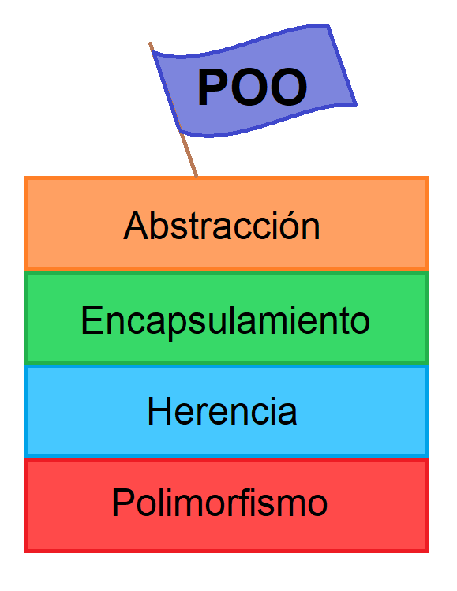

# ¿Que es POO?

## Conceptos básicos
La ***programación orientada a objetos (POO)***​ es un **paradigma de programación** que parte del concepto de *"objetos"* como base, los cuales contienen información en forma de *campos* (a veces también referidos como atributos, cualidades o propiedades) y código en forma de **métodos**.

Los objetos son capaces de interactuar y modificar los valores contenidos en sus campos o atributos (estado) a través de sus métodos (comportamiento).

Muchos de los objetos prediseñados de los **lenguajes de programación** actuales permiten la agrupación en bibliotecas o librerías, sin embargo, muchos de estos lenguajes permiten al usuario la creación de sus propias bibliotecas.

Algunas características clave de la programación orientada a objetos son ***herencia, abstracción, polimorfismo y encapsulamiento***.

## Conceptos fundamentales
La POO es una forma de programar que trata de encontrar una solución problemas. Introduce nuevos conceptos, que superan y amplían conceptos antiguos. Entre ellos destacan los siguientes:

* **Clase**:
Una clase es una especie de *"plantilla"* en la que se definen los atributos y métodos predeterminados de un tipo de objeto. Esta plantilla se crea para poder crear objetos fácilmente. Al método de crear nuevos objetos mediante la lectura y recuperación de los atributos y métodos de una clase se le conoce como instanciación.

* **Objeto**:
Instancia de una clase. Entidad provista de un conjunto de propiedades o atributos (datos) y de comportamiento o funcionalidad (métodos), los mismos que consecuentemente reaccionan a eventos. Se corresponden con los objetos reales del mundo que nos rodea, o con objetos internos del sistema (del programa).
Método
Algoritmo asociado a un objeto (o a una clase de objetos), cuya ejecución se desencadena tras la recepción de un "mensaje". Desde el punto de vista del comportamiento, es lo que el objeto puede hacer. Un método puede producir un cambio en las propiedades del objeto, o la generación de un "evento" con un nuevo mensaje para otro objeto del sistema.

* **Atributos**:
Características que tiene la clase.

## Características de la POO
Existe un acuerdo acerca de qué características contempla la ***"orientación a objetos"***. Las características siguientes son las más importantes:

* **Abstracción**:
Denota las características esenciales de un objeto, donde se capturan sus comportamientos. Cada objeto en el sistema sirve como modelo de un "agente" abstracto que puede realizar trabajo, informar y cambiar su estado, y "comunicarse" con otros objetos en el sistema sin revelar "cómo" se implementan estas características. Los procesos, las funciones o los métodos pueden también ser abstraídos, y, cuando lo están, una variedad de técnicas son requeridas para ampliar una abstracción. El proceso de abstracción permite seleccionar las características relevantes dentro de un conjunto e identificar comportamientos comunes para definir nuevos tipos de entidades en el mundo real. La abstracción es clave en el proceso de análisis y diseño orientado a objetos, ya que mediante ella podemos llegar a armar un conjunto de clases que permitan modelar la realidad o el problema que se quiere atacar.
* **Encapsulamiento**:
Significa reunir todos los elementos que pueden considerarse pertenecientes a una misma entidad, al mismo nivel de abstracción. Esto permite aumentar la cohesión (diseño estructurado) de los componentes del sistema. Algunos autores confunden este concepto con el principio de ocultación, principalmente porque se suelen emplear conjuntamente.
* **Polimorfismo**:
Comportamientos diferentes, asociados a objetos distintos, pueden compartir el mismo nombre; al llamarlos por ese nombre se utilizará el comportamiento correspondiente al objeto que se esté usando. O, dicho de otro modo, las referencias y las colecciones de objetos pueden contener objetos de diferentes tipos, y la invocación de un comportamiento en una referencia producirá el comportamiento correcto para el tipo real del objeto referenciado. Cuando esto ocurre en "tiempo de ejecución", esta última característica se llama asignación tardía o asignación dinámica. Algunos lenguajes proporcionan medios más estáticos (en "tiempo de compilación") de polimorfismo, tales como las plantillas y la sobrecarga de operadores de C++.
* **Herencia**:
Las clases no se encuentran aisladas, sino que se relacionan entre sí, formando una jerarquía de clasificación. Los objetos heredan las propiedades y el comportamiento de todas las clases a las que pertenecen. La herencia organiza y facilita el polimorfismo y el encapsulamiento, permitiendo a los objetos ser definidos y creados como tipos especializados de objetos preexistentes. Estos pueden compartir (y extender) su comportamiento sin tener que volver a implementarlo. Esto suele hacerse habitualmente agrupando los objetos en clases, y estas en árboles o enrejados que reflejan un comportamiento común. Cuando un objeto hereda de más de una clase, se dice que hay herencia múltiple; siendo de alta complejidad técnica por lo cual suele recurrirse a la herencia virtual para evitar la duplicación de datos.
